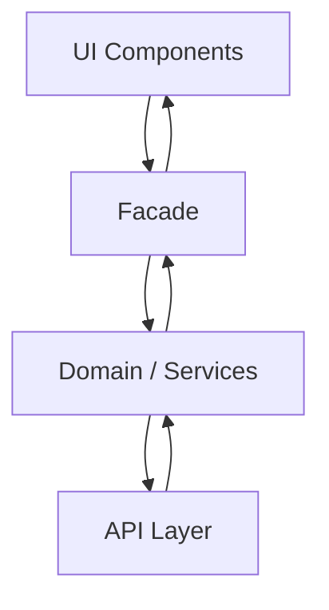

# Architecture

Important Principles, Possibilities & Techniques

---
layout: why
---

# Why Architecture Matters

The team needs to agree on repetitive patterns that smooth the development process. Clear concepts and boundaries.

- Messy codebases without agreed structure
- Hard onboarding for new team members
- Slow builds and unclear dependencies
- Unclear boundaries between domains

---
layout: little-what
---

# What is Architecture (in this context)?

From Project-Structure to Release-Strategy

---
layout: sub-section
---

# Project/Code-Structure

---
layout: why
---

# Why Project Structure Matters

A consistent structure makes navigation predictable and reduces cognitive load. Screaming Architecture (Robert C. Martin) means the folder structure reveals what the app does.

---
layout: little-what
---

# Project Structure Options

Feature-based (by domain) vs. layer-based (components/services/models). Monorepo vs multi-repo. Libraries and shared modules. Microfrontends.

---
layout: default
---

# Feature-based vs. Layer-based

- **Feature-based**: Organize by domain (`users/`, `orders/`, `products/`)
- **Layer-based**: Organize by technical role (`components/`, `services/`, `models/`)
- **Screaming Architecture**: Structure should "scream" the application's purpose

---
layout: default
---

# Example: Feature-based Structure

<WindowMockup codeblock title="src/app/" padding="2rem">
```
src/app/
├── users/
│   ├── user-list.component.ts
│   ├── user.service.ts
│   └── public-api.ts
├── orders/
│   ├── order-list.component.ts
│   ├── order.service.ts
│   └── public-api.ts
├── shared/
│   ├── ui/
│   └── public-api.ts
└── app.component.ts
```
</WindowMockup>

---
layout: sub-section
---

# Component Architecture

---
layout: why
---

# Why Component Architecture Matters

Smart vs. dumb components improve testability and reusability. Clear separation of concerns makes changes safer.

---
layout: little-what
---

# Smart vs. Dumb Components

- **Smart (Container)**: Handles data, state, side effects; talks to services/facades
- **Dumb (Presentational)**: Pure UI; receives @Input, emits @Output
- Design systems and UI libraries typically use dumb components

---
layout: two-cols-header
layoutClass: gap-x-2
---

# Smart & Dumb Components

::left::

**Data flow:**
- Component (Smart) fetches data via Facade
- Component passes data to Dumb children via `@Input`
- Dumb children emit events via `@Output`
- Smart component handles events and updates state

::right::

```mermaid
flowchart TB
    SmartComponent[Smart Component]
    DumbComponent[Dumb Component]
    Facade[Facade]
    Service[Service / Store]
    SmartComponent --> Facade
    SmartComponent --> DumbComponent
    Facade --> Service
    DumbComponent -->|@Output| SmartComponent
```

::bottom::
<Callout type="info">
Dumb components are easier to test and reuse in design systems
</Callout>

---
layout: sub-section
---

# State Management & Data Flow

---
layout: why
---

# Why State Management Matters

Centralized vs. decentralized state affects complexity and debugging. Clear data flow reduces bugs and improves predictability.

---
layout: little-what
---

# State Management Options

- Signal Store, Redux, or simple RxJS
- Centralized vs. decentralized store solutions
- Command Query Segregation (CQS) for clear boundaries

---
layout: default
---

# State Management Considerations

- Where does state live? (component, service, store)
- Unidirectional data flow vs. two-way binding
- CQS: Commands change state, Queries return data

---
layout: sub-section
---

# Layering & Abstraktionen

---
layout: why
---

# Why Layering Matters

Clear layers prevent circular dependencies and keep the codebase maintainable. Abstractions hide implementation details.

---
layout: little-what
---

# Typical Layers

UI (components) → Facade → Domain / Services → API

---
layout: two-cols-header
layoutClass: gap-x-2
---

# Layering: UI → Facade → Domain → API

::left::

**Layer responsibilities:**
- **UI**: Components, templates, presentational logic
- **Facade**: Orchestrates services, exposes simple API to components
- **Domain**: Business logic, models
- **API**: HTTP, external integrations

::right::



::bottom::
<Callout type="info">
Components should only talk to Facades, not directly to services
</Callout>

---
layout: sub-section
---

# Module/Domain Boundaries

---
layout: why
---

# Why Boundaries Matter

Without boundaries, domains import from each other freely. Refactoring becomes risky and dependencies grow uncontrolled.

---
layout: little-what
---

# Enforcing Boundaries

- [Sheriff](https://www.berger-engineering.io/articles/scalable-architecture-with-sheriff): Angular boundary rules
- [eslint-plugin-boundaries](https://github.com/javierbrea/eslint-plugin-boundaries): ESLint rules for architectural layers

---
layout: default
---

# eslint-plugin-boundaries

Define element types and dependency rules. ESLint reports violations at build time.

```ts
// Example: elements (users, orders) cannot import from each other
// models can only be imported, not import from views
```

---
layout: sub-section
---

# Performance Architecture

---
layout: why
---

# Why Performance Architecture Matters

Large bundles and unnecessary change detection slow down the app. Strategic optimizations improve UX and reduce costs.

---
layout: little-what
---

# Performance Techniques

Lazy loading, code splitting, change detection strategy, SSR/SSG, caching.

---
layout: default
---

# Performance Checklist

- Lazy load feature routes
- Use `OnPush` change detection where possible
- Consider SSR/SSG for first paint
- Cache HTTP responses and computed values

---
layout: sub-section
---

# Build & Deployment Architecture

---
layout: why
---

# Why Build & Deployment Matters

Monorepo tooling (e.g. Nx), CI/CD, and release strategies determine how fast and safely you can ship.

---
layout: little-what
---

# Build & Deployment Topics

- Monorepo (Nx)
- CI/CD pipelines
- Microfrontends
- Release strategies

---
layout: sub-section
---

# Documenting Architecture Decisions

---
layout: why
---

# Why Document Decisions

Decisions get forgotten. ADRs (Architecture Decision Records) capture the context and rationale for future readers.

---
layout: little-what
---

# Architecture Decision Records (ADRs)

Lightweight docs: Context, Decision, Consequences. Store in `docs/adr/` or similar.

---
layout: sub-section
---

# When to Use Nx — When Not

---
layout: why
---

# When Nx Helps

- Creating and sharing libraries (better DX than Angular CLI alone)
- Extremely long build times (cached builds, affected commands)
- Full-stack platform with harmonized tooling
- You value the approach and know the ecosystem

---
layout: little-what
---

# When Nx Might Not Fit

- You only want to extract libraries (Angular CLI can suffice)
- You want Angular + Storybook/Playwright without extra indirection
- You prefer fewer tooling layers for faster Angular upgrades

---
layout: two-cols
---

# Use Nx when...

::left::

- Sharing libraries across apps
- Need cached/affected builds
- Full-stack (Angular + .NET/Java/Node)
- Long build times hurting DX

::right::

# Skip Nx when...

- Simple library extraction only
- Want minimal tooling (Angular + Storybook)
- Prefer direct Angular updates without Nx indirection

---
layout: task
---

# Restructure the Application

Apply the architecture principles we discussed:

1. Feature-driven structure
2. `public-api.ts` for shared modules
3. Boundary checks with eslint-plugin-boundaries
4. Component → Facade → Services/Store

Complete the task **01-restructure-application** in your code repository.
